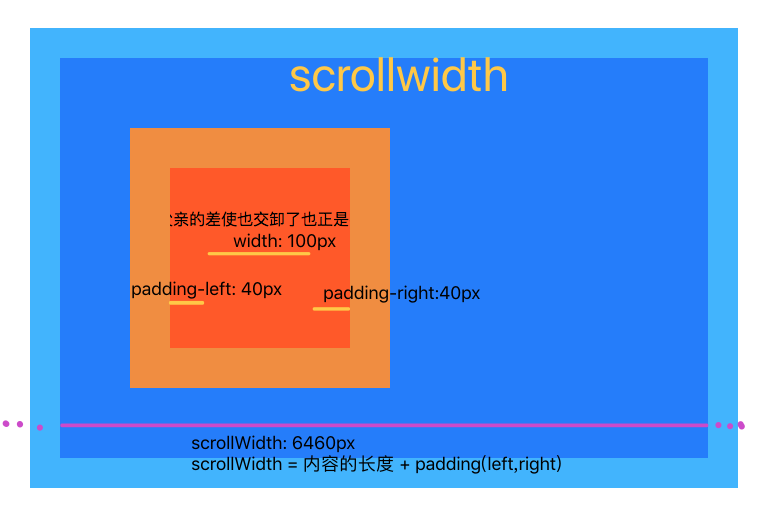
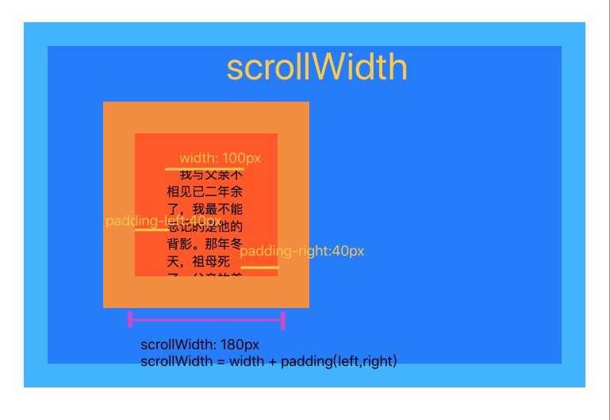

# 经常搞不懂ClientTop? OffsetTop? ClientWidth? ScrollWidth?
接下来图文并茂，一次搞懂！

## 1.scrollWidth
### scrollWidth = 可横向滚动内容的长度 + padding
#### [内容横向滚动](./code/scrollWidth2.html)

#### [内容纵向滚动](./code/scrollWidth.html)

## 2.scrollTop
### 向上滚动的距离
#### [页面向上滚动了多少距离](/code/scrollTop2.html)

#### [某个可滚动元素向上滚动了多少距离](/code/scrollTop.html)

## 3.[clientWidth](/code/clientWidth.html)
### clientWidth = width + padding

## 4.[clientTop](/code/clientTop.html)
### clientTop = border-top

## 5.[offsetWidth](/code/offsetWidth.html)
### offsetWidth = width + padding + border

## 6.[offsetTop](/code/offsetTop.html)
### 祖先元素没定位，则相对于浏览器；祖先元素有定位，则相对于离得最近的那个定位的祖先元素
### 从盒子border-top的上边缘开始网上算，到相对于的元素的border的下边缘为止

